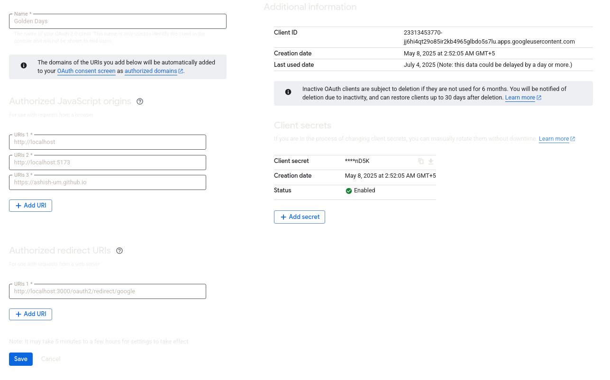

# 🌟 Contributing to PocketLIFE

🎉 Whether it’s fixing a bug, adding a feature, or improving documentation — **every contribution makes a difference**.

We’re excited to have you here! This guide will help you contribute smoothly and effectively.

---

### ⚙️ Prerequisites

Make sure the following are installed before setting up the project:

- [Node.js](https://nodejs.org/) (v16 or later)
- [npm](https://www.npmjs.com/) 
- [Git](https://git-scm.com/)

---

## 🛠️ How to Contribute

### ⭐ 1. Star and Fork the Repository

- Show your support by starring this repo!
- Fork the repository to your GitHub account using the "Fork" button.

### 🐛 2. Create or Claim an Issue

- Browse the [Issues](https://github.com/ashish-um/pocketLIFE/issues) tab.
- If the feature or bug you’re tackling doesn’t exist, create a new one with a clear description.
- **Wait for the maintainers to assign you** before you begin work.

### 📥 3. Clone Your Fork Locally

```bash
git clone https://github.com/<your-username>/pocketLIFE.git
cd pocketLIFE
```

Replace `<your-username>` with your actual GitHub username.

---

### 🌱 4. Create a New Branch

```bash
git checkout -b feature/<your-branch-name>
```

Use a meaningful name like `feature/encrypt-aes` or `fix/responsive-layout`.

---

### ✏️ 5. Make Your Changes

- Stick to clean, well-commented code.
- Follow project-specific conventions.
- Make sure your changes **do not break** existing functionality.

---

### 🧪 6. Set Up Environment Variables

To run the project locally, you’ll need to configure environment variables for both frontend and backend.

#### ✅ Use `.env.example`:

Both frontend and backend have a `.env.example` file. Copy and rename them as:

```bash
cp .env.example .env
```

#### 🔐 Where to Get Environment Variables

##### For `VITE_CLIENT_ID` (Frontend):
1. Go to [Google Cloud Console](https://console.cloud.google.com/)
2. Navigate to **APIs & Services > Credentials**
3. Click **Create Credentials > OAuth client ID**
4. Use the Client ID in `.env` file like so:

```env
VITE_CLIENT_ID=your-client-id-here
```

🖼️ Refer to the screenshot below for exact `.env` configuration details:



##### For Backend `.env`:
- Follow the template in `.env.example`
- Fill values based on backend requirements or coordinate with a maintainer.

---

### ✅ 7. Stage & Commit Your Work

```bash
git status
git add .
git commit -m "Add: [feature description] or Fix: [bug description]"
```

---

### 🚀 8. Push to GitHub

```bash
git push origin feature/<your-branch-name>
```

---

### 🔁 9. Create a Pull Request (PR)

- Open your fork on GitHub.
- Click **"Compare & pull request"**.
- Provide a meaningful title and description.
- Submit your PR and wait for review.

---

## 💡 Additional Notes

### 🧠 Tech Stack

PocketLIFE is a browser-based journaling tool built with:

- **Frontend:** HTML, CSS, JavaScript (likely with Vite)
- **Backend:** Node.js / Express (assumed)
- **Planned Features:** AES encryption, Google Drive sync, image uploads

---

### 🧪 Running Locally

1. Install dependencies:
```bash
npm install
```
2. Start the development server:
```bash
npm run dev
```
3. Open in browser:
[http://localhost:3000](http://localhost:3000)

> ⚠️ Make sure your `.env` is set up correctly before running.

---

### 🔄 Keeping Your Fork Updated

```bash
git remote add upstream https://github.com/ashish-um/pocketLIFE.git
git fetch upstream
git checkout main
git merge upstream/main
```

---

## 🙌 Thank You!

Your contribution is truly appreciated. Let’s build something amazing together! 💙

---

### 📌 Project-Specific Best Practices

- Never hardcode API keys or secrets in your code.
- Use environment variables via `.env` files.
- Follow the structure provided in `.env.example` for both frontend and backend.
- Name your branches clearly using prefixes like `feature/` or `fix/`.
- Keep your code clean and follow existing formatting/styles.
- Test your changes locally before submitting a PR.
